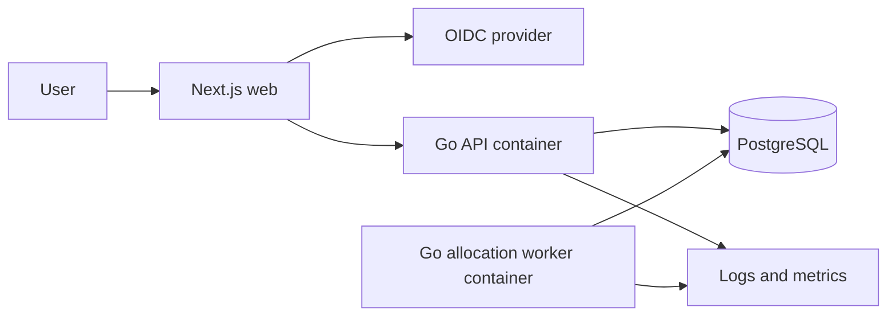
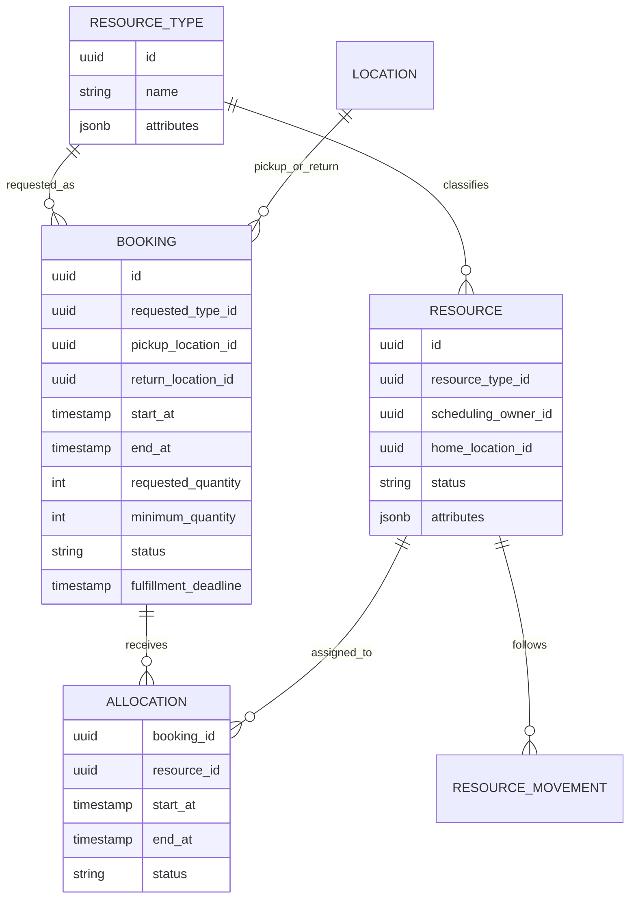
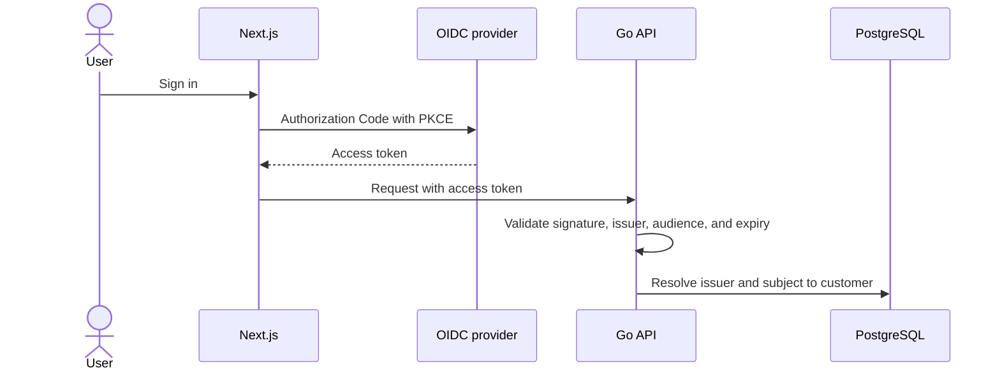
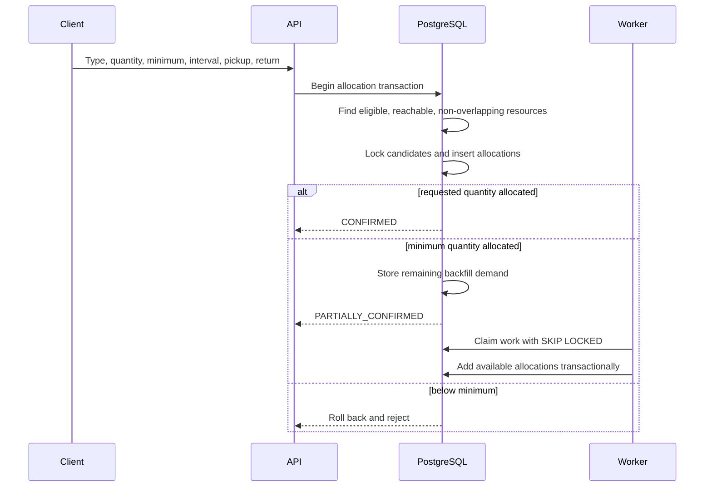
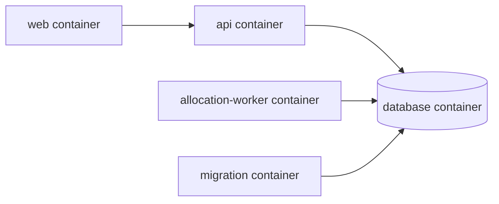
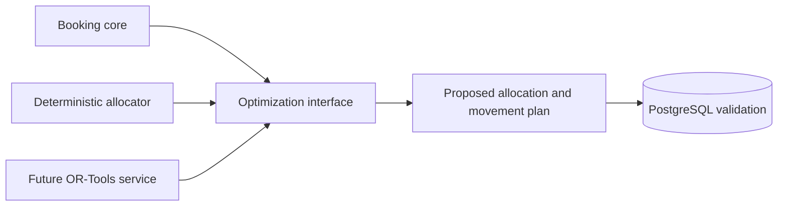

# Fleet booking system design

## Status and scope

**Status: Proposed replacement.** This design is not implemented by the current repository.

The current implementation remains the service-appointment scheduler defined by the completed OpenSpec change. This target architecture replaces it with fleet booking: users request a quantity of vehicles by type, may use different pickup and return locations, and may receive asynchronous backfill for missing quantity.

The core is intentionally resource-neutral:

- `resource_type`: a category such as compact car, van, or truck.
- `resource`: one individually bookable vehicle.
- `booking_policy`: eligibility, location, turnaround, and allocation rules.
- `booking`: customer demand for a type, quantity, interval, pickup, and return.
- `allocation`: assignment of one individual resource to a booking.

## Specification traceability

The implemented service scheduler is defined by the completed OpenSpec change:

- [Proposal](../openspec/changes/bootstrap-service-scheduler/proposal.md)
- [Capability specification](../openspec/changes/bootstrap-service-scheduler/specs/service-appointment-booking/spec.md)
- [Implementation design](../openspec/changes/bootstrap-service-scheduler/design.md)
- [Completed tasks](../openspec/changes/bootstrap-service-scheduler/tasks.md)

The fleet replacement described below is **Proposed** and is not represented by that completed change. It requires a separate OpenSpec change before implementation. **Alternative** sections describe optional future approaches rather than committed scope.

## Current implementation: why these technologies now

The implemented service scheduler deliberately uses a small, synchronous stack. These choices fit the current workload and keep the most important booking guarantees explicit without introducing infrastructure that the workflow does not yet need.

| Choice                    | Why it fits now                                                                                                                                                                                                                                                                          |
| ------------------------- | ---------------------------------------------------------------------------------------------------------------------------------------------------------------------------------------------------------------------------------------------------------------------------------------- |
| PostgreSQL                | Booking correctness depends on transactional writes and preventing overlapping resource allocations. PostgreSQL can enforce that invariant with partial GiST exclusion constraints, so every writer receives the same protection and conflicts remain visible in durable database state. |
| Go REST API               | Confirmation is a bounded request/response workflow. Go provides a small deployable service, straightforward concurrency, and strong database and HTTP support without requiring a separate application runtime or background processing tier.                                           |
| Next.js web application   | The booking journey benefits from a typed, component-based browser interface. Next.js supports that interface and production delivery while the generated TypeScript client keeps it aligned with the OpenAPI contract.                                                                  |
| OpenAPI-generated client  | One contract can define the API and generate the browser client. This catches drift during development instead of relying on manually duplicated request and response types.                                                                                                             |
| Structured JSON telemetry | Machine-readable events are easy to test, inspect locally, and collect from container output. They provide request and database correlation without requiring a hosted observability platform at this stage.                                                                             |
| Docker Compose            | The web app, API, migration step, and PostgreSQL can run as one reproducible stack in development and on the current single-host deployment. A container orchestrator would add operational overhead without solving a present scaling requirement.                                      |
| Caddy in production       | Caddy terminates HTTPS and presents the web application and `/api/*` under one origin. This keeps browser routing and cross-origin policy simple while avoiding custom TLS automation.                                                                                                   |

## Current implementation: trade-offs and alternatives

- PostgreSQL exclusion constraints and transactions make correctness durable and observable, at the cost of database-specific SQL. An application-only lock is more portable but cannot protect writes from every process.
- Availability is advisory and confirmation rechecks constraints. Holding a reservation would reduce stale selections but adds expiry, cleanup, and user-state complexity that the current booking journey does not require.
- Deterministic load-then-identifier ordering is predictable and easy to test. A richer assignment policy could improve fairness, but selecting one responsibly requires operational data and explicit business rules that do not yet exist.
- A single Go API process is sufficient for the bounded synchronous workflow. A worker or queue becomes useful for slow external integrations, reminders, or retryable side effects; none are required for confirmation itself.
- JSON telemetry keeps local development and the current deployment self-contained. A production exporter and collector would improve cross-instance aggregation, but also require retention, deployment, and cost decisions that are premature at the current scale.
- The browser calls the Go API directly in local development for a short feedback loop. Production uses Caddy for same-origin web and `/api/*` routing so TLS and browser-facing routing remain centralized without changing the API.

## Proposed: hard booking invariant

> One individual resource cannot have overlapping confirmed allocations.

Multiple resources of the same type may be booked concurrently. Type capacity for an interval is the count of eligible individual resources that can satisfy it. Qualification, routing, identity, partial fulfillment, and fairness are policies or requirements; they do not replace the database invariant.

## Proposed: architecture

- The API performs synchronous search and confirmation.
- PostgreSQL stores bookings, allocations, movements, and durable backfill work.
- The worker retries missing quantity and may scale to multiple containers.
- The API and worker are stateless; PostgreSQL is the initial consistency and queue authority.

## Proposed: data model

PostgreSQL uses a partial GiST exclusion constraint on `resource_id` and the half-open interval `[start_at, end_at)` for allocation statuses that consume capacity.

## Proposed: identity

The system accepts any standards-compliant OpenID Connect provider.

`(issuer, subject)` is the stable external identity. The API derives the customer identifier and applies ownership or staff authorization locally.

## Proposed: confirmation and partial fulfillment

- `requested_quantity` is the preferred fleet size.
- `minimum_quantity` is the smallest acceptable immediate allocation.
- `remaining_quantity` is derived from requested minus allocated.
- Backfill is best effort until `fulfillment_deadline`.
- Worker claims and retries are idempotent.
- Every added allocation is revalidated by PostgreSQL.

## Proposed: location continuity

A resource keeps one immutable scheduling owner even when its physical location changes. This keeps its complete allocation timeline under one transactional authority.

Version-one eligibility is deliberately simple:

1. The resource has no overlapping allocation.
2. Its type and attributes satisfy the booking policy.
3. Its preceding scheduled movement ends at the requested pickup location.
4. The turnaround interval is sufficient.
5. Its next allocation remains reachable after the requested return.

An explicit transfer movement may reposition a resource. Version one does not optimize transfers or routes.

## Proposed: Docker services

The API and worker may use the same Go image with different commands. Multiple workers claim distinct pending rows with `FOR UPDATE SKIP LOCKED`. Graceful shutdown commits or rolls back the active transaction before exit.

## Proposed: allocation strategy

### Version one: deterministic allocator

1. Filter active resources by requested type and policy.
2. Remove overlapping or unreachable resources.
3. Sort by stable policy, initially utilization then identifier.
4. Lock candidates and allocate up to the requested quantity.
5. Commit only when at least the minimum quantity is allocated.

Capacity counters alone are insufficient because the system must identify and route individual vehicles.

### Alternative: OR-Tools adapter

OR-Tools may later propose vehicle assignment, transfers, multi-location routing, and rebalancing that minimizes distance, cost, or unmet demand. PostgreSQL still validates every proposal and remains the no-overlap authority. Optimization improves utilization; it does not create physical fleet capacity.

## Proposed scaling and alternatives

| Stage | Architecture                        | Guarantee                          | Trade-off                                     |
| ----- | ----------------------------------- | ---------------------------------- | --------------------------------------------- |
| 1     | One PostgreSQL primary              | Strong local no-overlap constraint | One write authority                           |
| 2     | Horizontal APIs and workers         | Same database guarantee            | Writes still reach one primary                |
| 3     | Cache and read replicas             | Confirmation remains authoritative | Cached availability may be stale              |
| 4     | Shard by immutable scheduling owner | Strong within each owner shard     | One resource must never have multiple writers |
| 5     | OR-Tools optimization service       | Proposals only; database validates | More runtime and model complexity             |

Scale traffic independently from fleet capacity. More API or worker containers can process more demand, but only additional eligible vehicles or better routing can increase fulfillable bookings.

## Proposed: failure handling and verification

- Use idempotency keys for confirmation and worker retries.
- Return the allocated and remaining quantities explicitly.
- Expire unfinished backfill at its fulfillment deadline.
- Test boundary-touching intervals, overlapping allocations, partial allocation, backfill races, worker restarts, and location continuity.
- Monitor allocation conflicts, partial-fill rate, backfill age, worker retries, database pool saturation, and fleet utilization.
