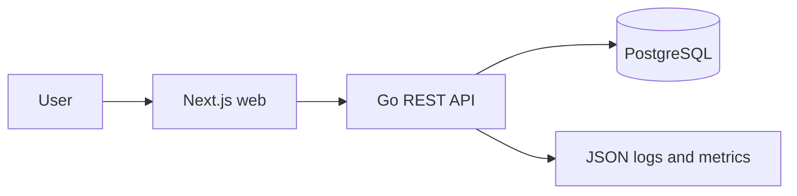
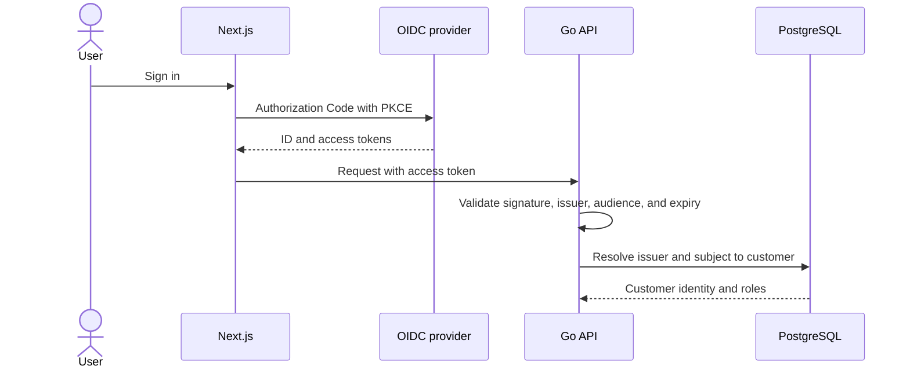
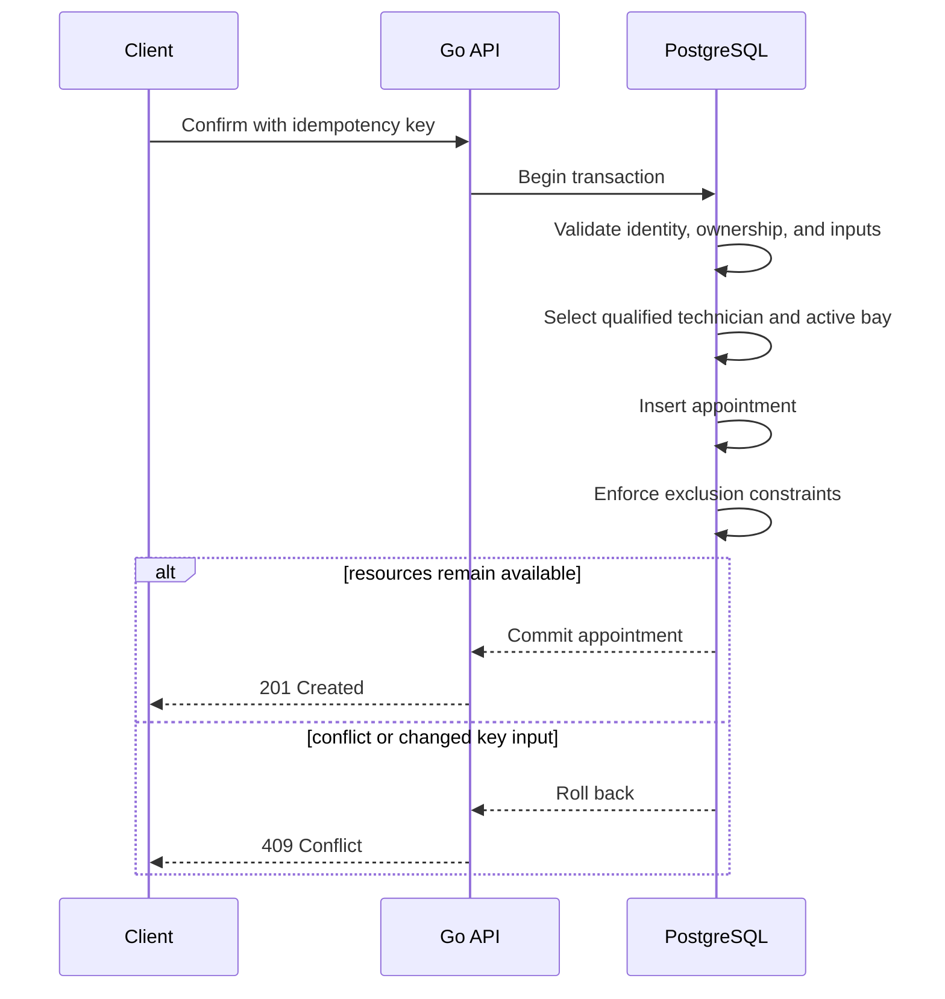
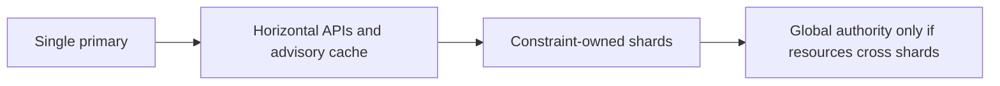
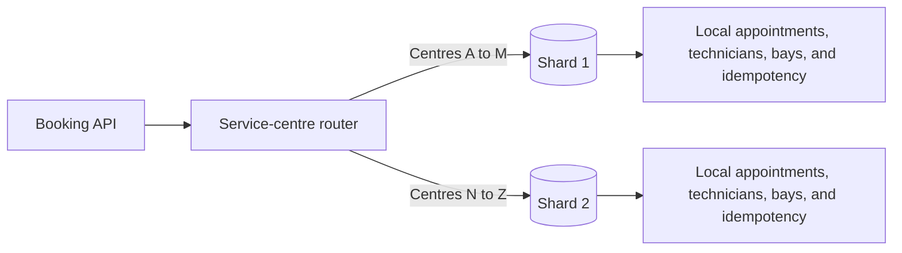
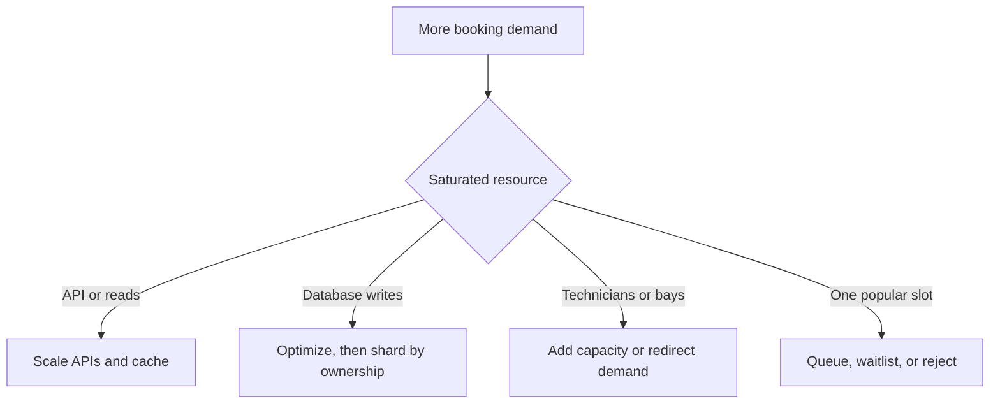

# System design

## Goals

Provide a reliable booking path for a customer, vehicle, service type, service centre, qualified technician, and service bay. Keep confirmation strongly consistent while allowing the web and API layers to scale independently.

## Current architecture

- Next.js consumes the generated OpenAPI client.
- The Go API is stateless and separates transport, application, domain, and PostgreSQL adapters.
- Availability is advisory. Confirmation repeats validation in one database transaction.
- PostgreSQL exclusion constraints prevent overlapping confirmed work for a technician or bay.
- Idempotency records make confirmation retries safe.

## User identity

The target identity design is compatible with any standards-compliant OpenID Connect provider.

- `(issuer, subject)` is the stable external identity key; email is not an identifier.
- The API derives `customer_id` from the validated identity. A client cannot select another customer.
- Vehicle and appointment access requires customer ownership. Staff access requires trusted claims or local role mappings.
- The provider owns authentication and MFA; the application owns authorization.
- Authentication and authorization are a proposed extension, not part of the current implementation.

## Target confirmation flow

With the proposed OIDC extension, confirmation adds authenticated ownership checks to the existing transaction:

The database is the final scheduling authority. Cached or replicated availability must never authorize confirmation.

## Scaling alternatives

Scale is qualitative: actual limits depend on hardware, query plans, transaction duration, and contention.

| Level | Architecture                             | Constraint model                           | Best fit                              | Main trade-off                          |
| ----- | ---------------------------------------- | ------------------------------------------ | ------------------------------------- | --------------------------------------- |
| 1     | One PostgreSQL primary                   | Strong local transaction                   | Small to medium workload              | One write authority                     |
| 2     | More API instances, cache, read replicas | Strong confirmation; advisory reads        | Read-heavy growth                     | Writes still use the primary            |
| 3     | Shard by service-centre ownership        | Strong inside one shard                    | Many independent centres              | No cross-shard resources                |
| 4     | Global scheduling authority              | Strong for resources it owns               | Cross-centre technicians or equipment | Booking coordination is still required  |
| 5     | Distributed transactions                 | Strong across shards                       | Mandatory atomic cross-shard booking  | Latency, locks, and recovery complexity |
| 6     | Reservation workflow or saga             | Eventual with holds and compensation       | Large asynchronous workflows          | Pending or failed-later outcomes        |
| 7     | Distributed SQL                          | Database-dependent distributed consistency | Global strict constraints             | Migration, cost, and hot-key limits     |

### Recommended evolution

1. Keep one PostgreSQL primary until measurements show a bottleneck.
2. Scale stateless API instances and cache only advisory availability reads.
3. Add replicas for reporting and other non-authoritative reads.
4. If write capacity is exhausted, shard by immutable `service_centre_id` ownership.
5. Introduce a global scheduler only if constrained resources must cross service centres.

## Sharding constraint

All data participating in one atomic booking constraint must share a transactional owner.

- Never split one service centre's technicians, bays, and appointments across write shards.
- Move an entire centre during rebalancing and fence its writes during cutover.
- Aggregate cross-shard reporting asynchronously.
- If a resource must span shards, choose a global authority, distributed transaction, reservation workflow, or distributed SQL. Ordinary PostgreSQL locks cannot protect it.

## Capacity versus traffic

More compute does not create appointment capacity. A technician or bay can serve only one overlapping confirmed appointment regardless of the number of API or database nodes.

## Failure handling and verification

- Return stable conflicts for stale availability, resource contention, and idempotency-key misuse.
- Bound database connections and allocation retries; use timeouts at every network boundary.
- Test OIDC validation, customer ownership, idempotent replay, stale caches, and concurrent confirmation.
- Before sharding, test routing, ownership enforcement, centre migration, and shard failure isolation.
- Monitor latency, conflicts, retries, database pool saturation, replication lag, and remaining technician/bay capacity.
