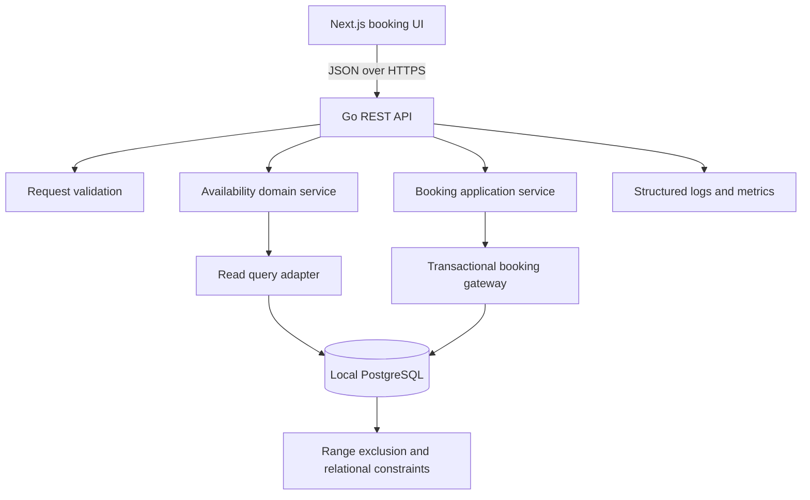

# Design

## Context

See [proposal.md](./proposal.md) for motivation and [the capability spec](./specs/service-appointment-booking/spec.md) for observable requirements. This is a greenfield repository intended to demonstrate a complete booking journey at no hosting cost for a small workload. The important engineering risk is concurrent allocation of two independently constrained resources, not raw traffic volume.

The supplied brief requires a design document, persistent REST backend, core-logic tests, operational considerations, and an AI collaboration narrative. It permits reasonable assumptions when requirements are ambiguous. Generated project artifacts must remain vendor-neutral and must not identify the source organization.

## Goals / Non-Goals

**Goals:**

- Deliver a credible end-to-end demonstration with durable PostgreSQL state.
- Make double-booking impossible at the database boundary, including across multiple application instances.
- Keep domain rules isolated from web and persistence details so they can be understood and tested independently.
- Run the Next.js frontend, Go API, and PostgreSQL together through Docker Compose for local development without requiring hosted accounts.
- Preserve traceability from source constraints and assumptions through decisions, tests, and implementation tasks.

**Non-Goals:**

- Design a general workforce optimizer or calendar platform.
- Add distributed infrastructure before measured demand requires it.
- Hide important consistency rules exclusively in client code or an ORM.
- Treat the availability response as a temporary reservation.

## Constraint and Assumption Register

| ID | Kind | Statement | Consequence / alternative |
|---|---|---|---|
| C1 | Source constraint | A request identifies vehicle, service type, dealership, and desired time. | These fields form the availability and confirmation inputs. |
| C2 | Source constraint | A bay and qualified technician must cover the full duration. | Allocation is an interval-intersection problem across two resource types. |
| C3 | Source constraint | Confirmation persistently associates customer, vehicle, technician, and bay. | The appointment row retains explicit foreign keys rather than reconstructing assignments later. |
| C4 | Source constraint | The backend is RESTful and persistent. | Route handlers expose JSON resources backed by PostgreSQL. |
| C5 | Source constraint | The design addresses operational quality attributes. | Performance, reliability, scaling, maintenance, and telemetry are first-class decisions below. |
| A1 | Assumption | Duration is fixed per service type. | Simple and deterministic; an alternative stores duration on each booking quote to support vehicle-specific labor times. |
| A2 | Assumption | One service type is booked per appointment. | Keeps interval and qualification logic focused; an alternative bundles services and derives a combined duration and skill set. |
| A3 | Assumption | Technicians belong to one dealership. | Avoids travel and roster modeling; an alternative uses effective-dated technician shifts across locations. |
| A4 | Assumption | Active bays are universally compatible. | Meets the stated constraint with a small model; an alternative adds bay capabilities matched to service requirements. |
| A5 | Assumption | Customers choose time, not technician or bay. | The server can allocate deterministically; an alternative exposes resources for user selection but creates avoidable contention and privacy concerns. |
| A6 | Assumption | Business hours are dealership-local and slots use a configurable 30-minute grid. | Predictable demo UX; an alternative searches continuous time or supports service-specific increments. |
| A7 | Assumption | Confirmed appointments block resources and cancelled appointments do not. | A partial database constraint can enforce this; an alternative models temporary holds with expiry, adding cleanup and contention. |
| A8 | Assumption | Availability is advisory. | Confirmation may return a conflict after a slot was displayed; an alternative creates expiring holds, which improves conversion at considerable complexity. |
| A9 | Assumption | Intervals are half-open `[start, end)`. | Back-to-back bookings are legal and overlap semantics are unambiguous. |
| A10 | Assumption | API instants require an explicit offset and storage is UTC. | Prevents ambiguous local input; an alternative accepts dealership-local timestamps but must define daylight-saving gap and fold behavior. |

## Architecture

The Next.js application is a frontend-only client. A separate Go service owns `/api/v1`, domain and application services, PostgreSQL adapters, migrations, seeds, load simulation, and backend telemetry. Go package boundaries enforce dependency direction: HTTP handlers depend on application services; application services depend on domain types and narrow repository interfaces; PostgreSQL adapters implement those interfaces. Database functions and constraints remain part of the persistence boundary rather than leaking into either presentation or transport code.

## Decisions

### D1. Use a Next.js frontend and a Go backend

**Basis:** C4, C5, the reproducible local-development goal, and the need for an end-to-end demonstration.

Next.js App Router with TypeScript hosts only the booking UI. A Go HTTP service hosts `/api/v1` and owns validation, scheduling policy, transactions, database access, migrations, seeds, concurrency simulation, and backend telemetry. The frontend consumes the OpenAPI contract and does not connect directly to PostgreSQL.

**Alternatives and trade-offs:**

- A Next.js monolith has fewer deployment units, but makes the requested Go backend incidental and couples UI release concerns to the scheduling service.
- A Go-rendered web application provides one language and one deployable, but gives up the existing React interaction model and frontend development workflow.
- Adding a Python scheduling or worker service would demonstrate another language, but creates a network boundary and failure mode without an independently scalable workload.
- A browser-to-database application reduces server code, but couples the client to database policy and makes transactional intent less discoverable.

The split is selected because Go owns the complete backend coherently while Next.js remains focused on presentation. The cost is cross-origin configuration and two deployables; the benefit is a clear API boundary, container portability, and one backend language for production code and operational tools.

### D2. Keep PostgreSQL as the concurrency authority

**Basis:** C2, C3, A7, A8, and A9.

Appointments store `start_at`, `end_at`, `technician_id`, `service_bay_id`, and status. PostgreSQL `btree_gist` exclusion constraints reject overlapping `tstzrange(start_at, end_at, '[)')` values for the same technician and for the same bay when status is `CONFIRMED`. Foreign keys, positive-duration checks, and uniqueness constraints protect relational invariants.

A database booking function executes in one transaction: validate active reference records and ownership, derive duration, select a deterministic qualified technician and bay, insert the appointment, and return it. If a selected pair loses a race, the function retries another eligible pair within a small bounded attempt count; otherwise it returns a resource conflict. The application maps exclusion violations to HTTP 409.

**Alternatives and trade-offs:**

- Application-only `check then insert` logic is easy to read but fails across concurrent requests and multiple instances.
- Serializable isolation can protect broader predicates, but increases retries and obscures the specific invariant; exclusion constraints state the business rule directly.
- Advisory locks can serialize a dealership and time window, but lock-key design is error-prone and reduces concurrency.
- Pessimistically locking all candidate resources is explicit, but creates lock-order and throughput concerns.

Exclusion constraints provide the strongest final guard. The trade-off is PostgreSQL-specific SQL and the need for real-database integration tests.

### D3. Separate advisory availability from authoritative confirmation

**Basis:** A8 and the absence of a hold requirement.

`GET /api/v1/availability` computes candidate slots from dealership hours and subtracts intervals occupied by confirmed appointments. It requires a simultaneous qualified-technician and bay gap but does not reserve either. `POST /api/v1/appointments` repeats all validation and allocation transactionally.

**Alternatives and trade-offs:**

- An expiring hold after slot selection gives a smoother high-contention checkout, but needs hold ownership, expiry, cleanup, and abuse controls.
- Caching availability improves repeated reads, but creates invalidation complexity and does not remove the authoritative confirmation check.

The chosen approach may show a slot that loses a race. The API returns a clear conflict and the UI refreshes availability, favoring correctness and simplicity.

### D4. Use deterministic server-side resource assignment

**Basis:** A5.

Eligible resources are ordered by fewest future assignments, then stable identifier. This creates reproducible tests and spreads work without claiming to optimize a full roster.

**Alternatives and trade-offs:**

- First identifier only is simpler but can repeatedly favor one person or bay.
- Random assignment spreads load but makes tests and support investigations less reproducible.
- An optimization solver could account for utilization and preferences, but requires objectives and constraints absent from the requirements.

The heuristic is intentionally modest. It may not yield globally optimal schedules, but the rule is explainable and can be replaced behind the booking gateway.

### D5. Model time explicitly

**Basis:** A6, A9, and A10.

The API uses ISO 8601 timestamps with offsets. PostgreSQL stores `timestamptz`; dealership records store an IANA timezone for rendering business hours. Availability generates starts on a 30-minute grid and includes a slot only when the complete duration lies inside one local business-hours interval. All overlap calculations use half-open intervals.

**Alternatives and trade-offs:**

- Accepting offset-free local timestamps looks friendlier but is ambiguous during daylight-saving transitions.
- Storing local timestamps preserves wall time but makes cross-zone comparison and overlap checks unsafe.
- A fixed UTC schedule avoids DST complexity but does not reflect dealership working hours.

Explicit offsets make the API slightly stricter while preventing silent scheduling errors.

### D6. Use idempotent confirmation

**Basis:** unreliable networks and the requirement for durable confirmation.

The client supplies an `Idempotency-Key`. A hash of normalized request input and the resulting appointment identifier are stored under a unique key. A retry with the same hash returns the original appointment; key reuse with different input returns HTTP 409.

**Alternatives and trade-offs:**

- Relying on the UI to disable the button does not cover retries, timeouts, or multiple application instances.
- A natural uniqueness constraint on vehicle and time prevents some duplicates but cannot distinguish a retry from a deliberate new request.

Idempotency adds storage and request hashing, but closes a common reliability gap without another service.

### D7. Use local PostgreSQL, SQL migrations, and thin typed adapters

**Basis:** maintainability and a reproducible local environment.

Versioned SQL migrations own extensions, tables, constraints, indexes, seed fixtures, and the booking function. Go adapters use explicit row types and parameterized queries through `pgx`. Domain packages do not import HTTP or database clients.

Docker Compose provides PostgreSQL to the Go API, migration commands, and integration tests over the private Compose network. Local credentials are development-only defaults; overrides stay in untracked environment files. The API and migrations accept standard PostgreSQL URLs so a hosted provider can be selected later without changing domain code or SQL.

**Alternatives and trade-offs:**

- An ORM improves common CRUD ergonomics, but advanced exclusion constraints and transactional functions still require custom SQL and can split the schema source of truth.
- Direct database calls throughout route handlers minimize files but entangle validation, HTTP mapping, and persistence.
- A platform-specific database SDK could simplify a later hosted setup, but `pgx` preserves standard PostgreSQL behavior and keeps the current environment provider-neutral.

SQL-first migrations expose the hard parts honestly. Thin adapters require some manual mapping, but the approach keeps boundaries clear and retains standard PostgreSQL semantics.

### D8. Expose a small versioned REST surface

**Basis:** C1, C4, and stable client behavior.

The initial API surface is:

- `GET /api/v1/booking-options`
- `GET /api/v1/availability?vehicleId=&dealershipId=&serviceTypeId=&date=`
- `POST /api/v1/appointments` with `Idempotency-Key`
- `GET /api/v1/appointments/{appointmentId}`
- `GET /api/v1/health/live` and `GET /api/v1/health/ready`

Request and response schemas are documented in OpenAPI. Errors use `{ code, message, requestId, details? }`.

**Alternatives and trade-offs:**

- GraphQL can tailor compound reads, but adds schema/runtime surface for four focused operations.
- Server actions reduce client plumbing, but do not fulfill the explicit REST contract and are less convenient for external verification.

REST and OpenAPI give reviewers a portable contract and make the backend testable without the UI.

### D9. Add structured telemetry with privacy limits

**Basis:** C5 and the operational-evidence requirement.

Each request receives or creates a request ID. JSON logs record route, duration, result code, dealership ID, service-type ID, database conflict class, and bounded retry count. Metrics cover request latency/error rate, availability result count, confirmations, conflicts, and database duration. Trace-context headers are propagated, and database spans can be added through OpenTelemetry when a collector is configured. Logs exclude customer names, contact details, vehicle registrations, and raw request bodies.

**Alternatives and trade-offs:**

- Full OpenTelemetry export in the first demo is richer but requires a collector and hosting destination.
- Plain console strings are dependency-free but hard to query and correlate.

Structured output works locally through container logs; optional exporters can be added without changing domain code after an observability destination is selected.

### D10. Test at the boundary that owns each risk

**Basis:** the core-logic test constraint and C2/C3.

- Go unit tests cover interval boundaries, slot generation, qualification, validation, and deterministic ordering.
- Go PostgreSQL integration tests cover migrations, constraints, atomic rollback, idempotency, and genuinely concurrent confirmations.
- Go HTTP tests cover status/error mapping and safe telemetry.
- One Playwright flow validates selection through persisted confirmation and reload.

**Alternatives and trade-offs:**

- Mock-only persistence tests run faster but cannot prove database concurrency behavior.
- End-to-end-only tests are realistic but slow and make failures hard to localize.

The mixed test pyramid costs a local PostgreSQL dependency, which is justified because the database owns the most important invariant.

## Data Model

Core relations are:

- `customers` own `vehicles`.
- `dealerships` own `service_bays` and `technicians` and define timezone and business hours.
- `service_types` define duration; `service_type_required_skills` links their required skills.
- `technician_skills` links technicians to skills.
- `appointments` link customer, vehicle, dealership, service type, technician, and bay and store the authoritative interval and status.
- `idempotency_records` bind a client key to a normalized request hash and appointment.

Indexes support active resource lookup, skill matching, dealership/date appointment scans, and appointment retrieval. Denormalized customer and dealership keys on appointments are retained deliberately so referential constraints can assert that the selected vehicle and resources belong to the expected entities.

## Data Flow

1. The browser loads active booking options.
2. After the user selects vehicle, dealership, service type, and date, the browser requests availability.
3. The service validates references and time input, generates dealership-local candidate intervals, and queries for a simultaneous technician/bay gap.
4. The browser presents returned slots without implying a reservation.
5. Confirmation sends the selected start and an idempotency key.
6. The database transaction revalidates inputs, derives the end time, allocates both resources, and inserts the appointment under overlap constraints.
7. The API returns 201, a prior 200 result for an idempotent replay, or 409 when allocation is no longer possible.
8. The confirmation view retrieves the persisted appointment, so a page reload demonstrates durability.

## Quality Attributes

- **Scalability:** Stateless application instances can scale horizontally because PostgreSQL owns consistency. Scale reads with indexes and, only after measurement, replicas or short-lived availability caching.
- **Performance:** Query by dealership and bounded date windows; use GiST range indexes and skill indexes; return compact slot projections; avoid per-slot queries.
- **Reliability:** Database constraints, transactions, idempotency, bounded retries, readiness checks, and migration verification protect common failure modes.
- **Maintainability:** Focused Go packages, narrow ports, a generated TypeScript API client, versioned API schemas, SQL migrations, stable error codes, and architecture decision rationale keep changes local and reviewable.
- **Observability:** Correlated structured logs, RED-style HTTP metrics, booking conflict metrics, database timing, and optional trace export make both user failures and contention visible.

## AI Collaboration and Verification Strategy

AI assists with requirement extraction, ambiguity enumeration, alternatives, scaffolding, focused implementation, test generation, and documentation. Human ownership is preserved through this sequence:

1. Separate source constraints from assumptions before choosing architecture.
2. Require traceable trade-offs for material decisions.
3. Implement from reviewed OpenSpec artifacts in small test-driven increments.
4. Inspect dependency licenses and generated migrations rather than accepting boilerplate blindly.
5. Run Go formatting and static analysis, TypeScript formatting and type checks, unit tests, database integration tests, and the booking flow after changes.
6. Exercise simultaneous confirmations against a real PostgreSQL instance to verify the invariant that mocks cannot establish.
7. Review tracked files and Git history for prohibited identifying material before delivery.

The README will summarize the actual prompts and verification performed during implementation. It will not claim checks that were not run.

## Risks / Trade-offs

- **Local connection pressure** -> Use short transactions and bounded `pgxpool` settings even in Compose so later environments retain safe defaults.
- **Two deployables can drift** -> Generate the frontend client from the checked OpenAPI contract and run contract tests in CI.
- **A future database provider may differ from local PostgreSQL** -> Keep migrations standard where possible and require extension and concurrency verification before selecting a provider.
- **A displayed slot loses a race** -> Return a stable 409 response, refresh availability, and explain that displayed slots are not holds.
- **PostgreSQL-specific constraints reduce database portability** -> Accept the coupling because it makes the core invariant enforceable and inspectable.
- **SQL booking logic can become hard to maintain** -> Keep the function focused, version it in migrations, document inputs/outputs, and test it through public adapters.
- **DST transitions can create missing or repeated local times** -> Generate candidate instants using the dealership IANA zone and require explicit offsets at API boundaries.
- **Deterministic load balancing is not a full optimizer** -> Document the heuristic and keep assignment behind a replaceable persistence interface.
- **Free-tier cold starts increase latency** -> Show a loading state, measure route/database duration, and avoid extra network services.
- **Seed data could accidentally resemble real people or organizations** -> Use plainly fictional neutral fixtures and scan tracked content before delivery.

## Migration Plan

1. Build the Next.js and Go development images through Docker Compose.
2. Start PostgreSQL and wait for its health check before applying migrations.
3. Apply migrations in order and verify required extensions and constraints against a fresh local volume.
4. Load fictional seed data only in the local demonstration environment.
5. Start the Go API after migrations succeed, then start the Next.js frontend and run one synthetic booking through the Compose stack.
6. Reset local state by removing the named PostgreSQL volume. Before future destructive schema changes, add a forward corrective migration rather than rewriting applied migrations.

Production hosting, managed database, domains, TLS termination, and deployment automation remain future decisions. Selecting them requires verifying the same migration, extension, concurrency, health, and contract checks in that environment.

There is no legacy data migration in this greenfield change.
